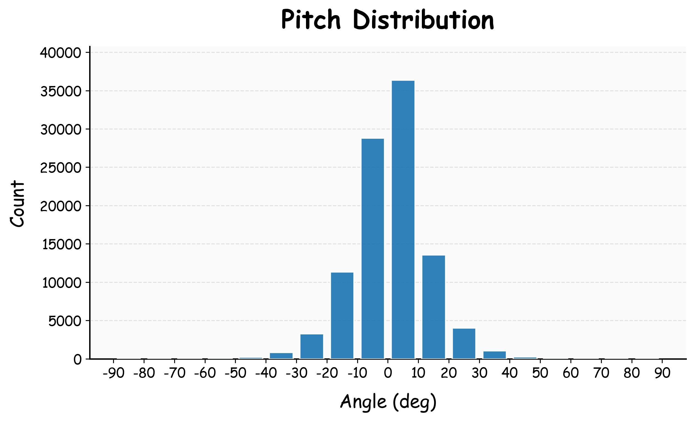
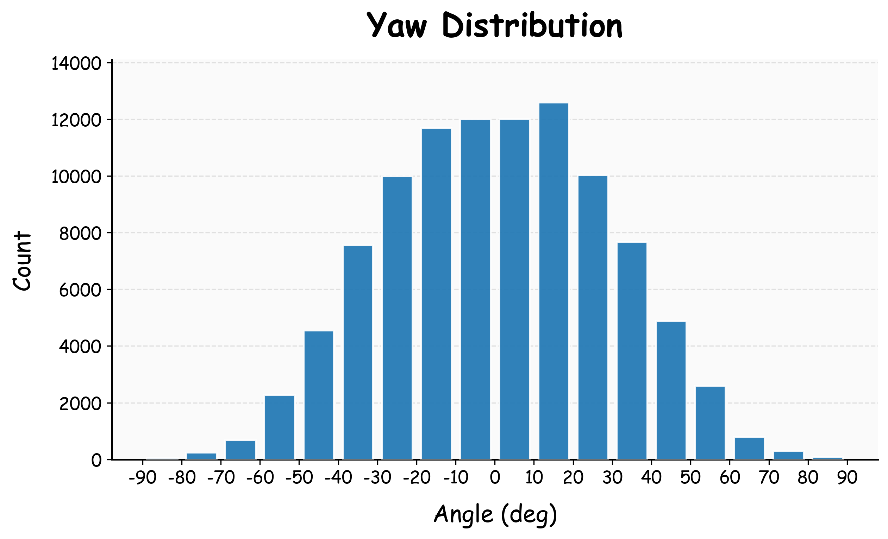

<div align="center">
<h1>📸 ViewRec3D: Learning to Recommend 3D Viewpoints for AI Photography</h1>

</div>

## 🔎 Overview

> **Review-only notice.** This anonymous repository is provided solely to support the review of an ongoing academic submission. Please do not redistribute, mirror, or reuse this code outside the review process before the authors release the official public version.

ViewRec3D introduces a novel data generation pipeline for the 3D viewpoint recommendation task and releases a 100K-scale high-quality dataset built with this pipeline. Trained on this dataset, our model achieves strong quantitative and qualitative performance, supported by LLM-based viewpoint preference evaluation and human studies.

## ✨ Highlights

* 📦 Dataset and benchmark: large-scale 3D viewpoint recommendation dataset `ViewRecDB-100K` and task-specific benchmark `ViewRecEval`.
* 🛠️ Data generation: automated pipeline for constructing suboptimal-to-optimal viewpoint pairs with `3D reconstruction`, `rendering`, `restoration`, and `hierarchical filtering`.
* 🧠 Model and supervision: view recommendation model `ViewRecNet` with a `ray-based dense supervision`.

## 📌 Additional Information

To facilitate reproducibility and further research, we provide additional details that are not fully covered in the paper, including dataset distribution and full prompt used by LLM-based viewpoint rater.

<details>
<summary><strong>📊 Dataset distribution</strong></summary>
To verify that our dataset exhibits large viewpoint changes, we conduct a statistical analysis of its distribution. Considering that translation is scale-ambiguous and roll is usually not a major factor in viewpoint changes, we report only the distributions of <code>pitch</code> and <code>yaw</code>.
<p align="center">
  
  
</p>
</details>

<details>
<summary><strong>📝 Full prompt</strong></summary>
<p>We provide the full prompt used by the LLM-based viewpoint rater, corresponding to Sec. 3.2 and Fig. 4 of our paper.</p>
<blockquote>
<strong>#System</strong><br>
You are a professional expert in photographic composition analysis.<br>
Your task is to compare two photos taken from different viewpoints ([image1], [image2]) strictly based on photography composition [comparison], and determine which photo has the better composition [preferred].<br>
You must strictly follow these evaluation steps:<br>
First, identify the subject in image1, that is, the common core of what the two images are trying to express, and treat it as the shared subject for both image1 and image2.<br>
Then, determine the genre and mode of expression of [image1] and [image2]: whether they emphasize a single subject, the relationship between subject and environment, the overall space, still-life arrangement, or action and narrative. Note that if the main visual focus of the image is a person (single or multiple), the person should be prioritized as the core subject.<br>
Next, compare how well the shared subject is expressed in [image1] and [image2], including whether the subject is clear, prominent, reasonably positioned, appropriately scaled, well coordinated with the background, and effectively represented. For scene-level subjects, the entire scene does not need to be shown. The composition may focus on a specific part of the scene to represent and convey the overall structure or character. A well-composed partial view can be more effective than a wider but less focused depiction. If the difference in subject expression between [image1] and [image2] is small, then compare secondary compositional factors: line organization, naturalness of perspective, stability of horizontal and vertical structures, foreground-midground-background layering, sense of depth, visual balance, effectiveness of negative space, and so on. This part of the comparison should focus on the viewer’s perceptual impression of the image.<br>
Finally, explain the comparison process (no more than 3 sentences) and state which image is better.<br>
Important:<br>
Do not mechanically assume that a larger subject is always better, that a more complete scene is always better, that a more open space is always better, or that stronger symmetry is always better; all judgments must serve the expression of the shared subject in [image1] and [image2].<br>
A wider or more complete view is not inherently better; preference should be given to compositions with stronger control, clearer structure, and more intentional organization of the subject.<br>
"preferred" must be either 1 or 2, indicating that image1 has the better composition or image2 has the better composition.<br>
Output JSON only, with no additional text.<br>
Input:<br>
[image1]<br>
[image2]<br>
Output:<br>
{ "comparison": "...", "preferred": &lt;1|2&gt; }<br>
<strong>#User</strong><br>
Below are reference examples for judging which photo has the better composition based on image analysis.<br>
Note:<br>
Each example demonstrates a reasoning process rather than rigid rules. Do not mechanically follow the specific reasons used in the examples to judge compositional quality; instead, infer the decision-making process from them.<br>
Do not imitate the wording of the examples.<br>
Example1:<br>
{ "comparison": "Image1 places the dune peak near a rule-of-thirds point, making the subject more prominent and clearly structured. The large foreground dune and open sky create a balanced visual weight and a natural viewing flow. Image2 is more expansive but weakens subject emphasis and compositional focus.", "preferred": 1 }<br>
Example2:<br>
{ "comparison": "Image1 uses a close-up composition to clearly emphasize key elements like the wheel, body lines, and surface structure, forming a stable triangular arrangement. The subject is more focused and visually guided toward important details. Image2 includes more context but weakens emphasis and compositional clarity.", "preferred": 1 }<br>
Example3:<br>
{ "comparison": "Image1 uses a panoramic composition with the horizon placed near the lower third, creating a stable structure and balanced spatial distribution. The sky and sea form a continuous visual field with clear layering and comfortable depth. Image2 introduces a strong foreground frame but disrupts the simplicity and weakens overall compositional coherence.", "preferred": 1 }<br>
Example4:<br>
{ "comparison": "Image1 places the person centrally with balanced terrain on both sides, forming a stable and symmetric composition that clearly emphasizes the human subject within the environment. The horizon aligns well with compositional divisions, supporting a coherent spatial structure. Image2 includes more environment but reduces the subject’s prominence and weakens the compositional focus on the person.", "preferred": 1 }<br>
Example5:<br>
{ "comparison": "The shared subject is the living room interior, focusing on spatial structure and furniture arrangement. Image1 presents a more controlled composition with a clear foreground–midground–background organization, where elements are aligned along a depth axis and relationships are tightly structured. Image2 shows a wider view but disperses attention and weakens the compositional control of the scene.", "preferred": 1 }<br>
Example6:<br>
{ "comparison": "The shared subject is the architectural scene, with the building as the primary subject rather than the open plaza. Image1 keeps the architecture in the dominant position, using the facade and perspective lines to establish a clear visual focus, while the foreground branches only add secondary layering. Image2 provides more open space and stronger framing, but too much attention shifts to the plaza and trees, weakening the building’s compositional dominance.", "preferred": 1 }<br>
</blockquote>
</details>

## 🚀 Quick Start

**🧩 Preparation**

Clone this repository to your local machine, and install the dependencies:

```bash
git clone git@github.com:anonymous1-submission/ViewRec3D.git
cd ViewRec3D
conda create -n ViewRec3D python=3.12
conda activate ViewRec3D
pip install -r requirements.txt
```

Manually download the `VGGT` checkpoint file from [here](https://huggingface.co/facebook/VGGT-1B/resolve/main/model.pt?download=true), rename the downloaded `model.pt` file to `vggt.pt`, and place it under `src/vggt/VGGT-1B/`.

**🏋️ Training**

Download our dataset `ViewRecDB-100K` from here and decompress it.

We train our model on `2 × NVIDIA RTX 5090 GPUs` using the following command:

```bash
python -m torch.distributed.run \
  --master_port=29500 \
  --nproc_per_node=2 \
  -m src.train \
  --train_dir your_dir/train \
  --val_dir your_dir/test \
  --output_dir your_dir/output \
  --use_rays True \
  --num_train_epochs 5
```

To further validate the results of our ablation studies and variant experiments, you can modify the `data_ratio`, `data_angle`, and `use_rays` parameters. More details can be found in `src/vggt/arguments.py`.

## 🙏 Acknowledgement

This repository is built upon the original [VGGT repository](https://github.com/facebookresearch/vggt). We sincerely thank the VGGT authors for releasing the code and checkpoints.
